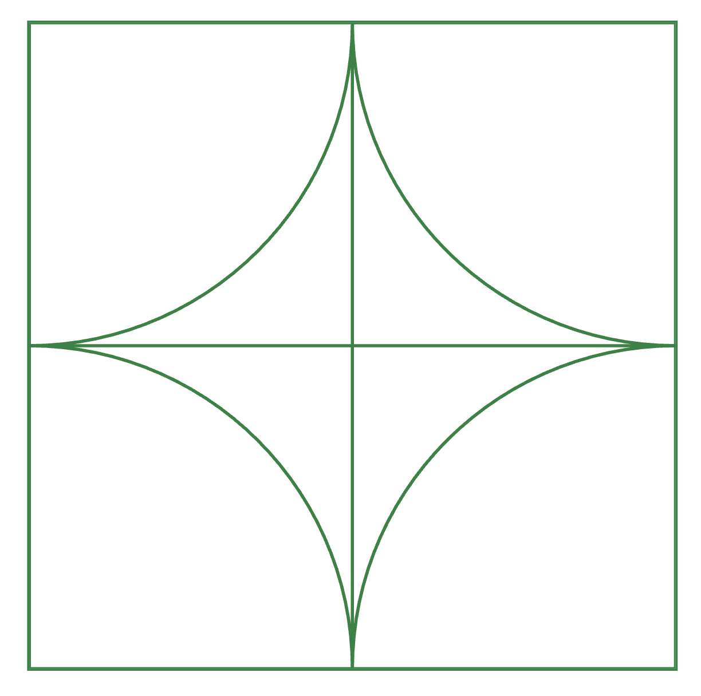
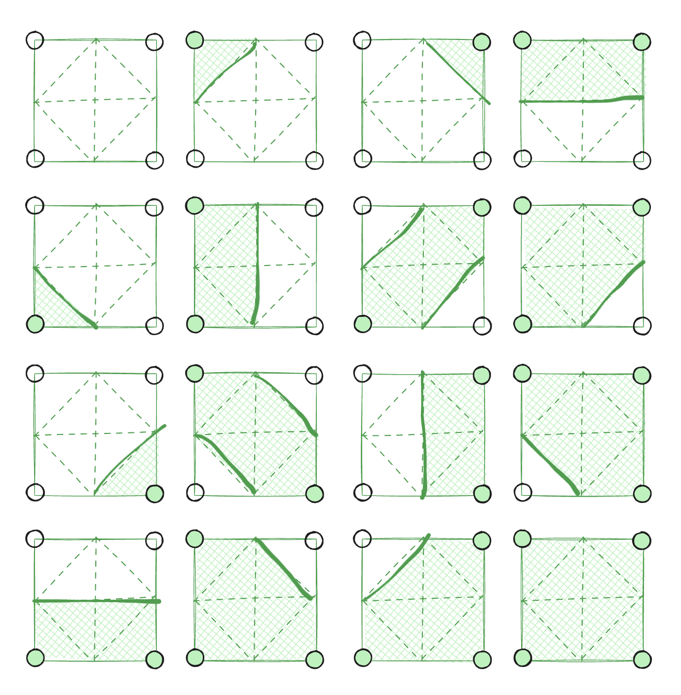
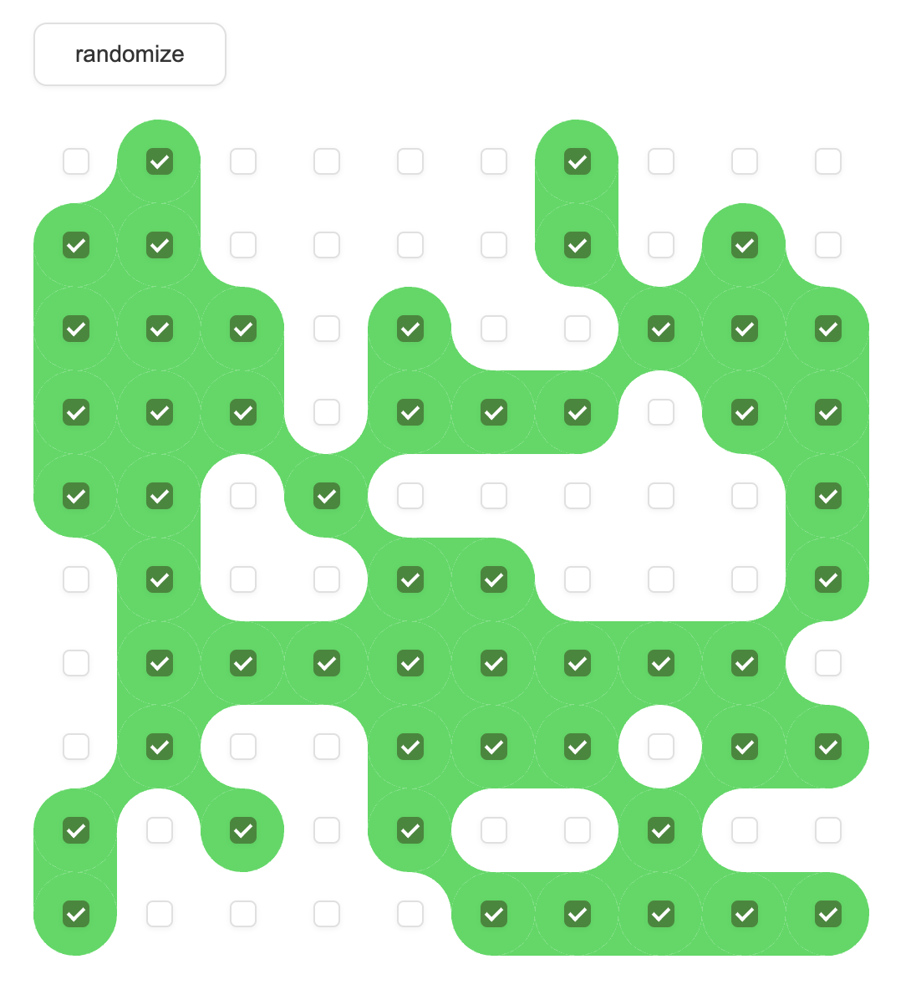

#  Эбру (40 баллов)

 

Эбру — это древнее искусство рисования на воде, которое также называют «турецким мраморированием». Суть техники состоит в том, что на поверхности специальной, загущённой воды создают узоры из нетонущих красок. Затем узоры переносят на бумагу или другую поверхность. Нередко такая мраморированная бумага используется для каллиграфии — узоры эбру служат идеальным фоном для сур, стихов и официальных документов, создавая гармоничный союз двух искусств.

 

В цифровой интерпретации этого искусства мы можем использовать алгоритм Marching Squares для преобразования дискретных точек в плавные контуры, имитирующие природное растекание красок эбру.

 

Ваша задача — реализовать на чистом HTML + CSS визуализацию [Marching Squares](https://ru.wikipedia.org/wiki/Marching_squares) . Сетка чекбоксов представляет собой «поверхность воды», где каждый активированный чекбокс — капля краски на воде. А тайлы (пространство между 4 соседними по стороне чекбоксами) замощают всё пространство воды. Они визуализируют органические формы, возникающие при соединении красок с водой. В результате получается плавное отображение дискретного пространства.

 

Решением задачи будет являться реализованный тайл квадратной формы. Ожидается тайл, в углах которого окружности с радиусом в половину тайла (см. скриншот). 

 

Также предлагается схематичная таблица комбинаций состояний 4-х соседей.

 

 

Каждый тайл имеет родителя с набором классов:

 

 
 
- tl — если состояние верхней левой клетки активно 
 
- tr — если состояние верхней правой клетки активно 
 
- bl — если состояние нижней левой клетки активно 
 
- br — если состояние нижней правой клетки активно 

 

Для удобства разработки и отладки прилагается плейграунд, в котором можно интерактивно взаимодействовать с чекбоксами. Там же уже написан код, который будет генерировать таблицу нужного размера и правильно расставлять классы на клетки в зависимости от состояний чекбоксов.

 

Считаем, что тайл, лежащий в конкретной ячейке, отображает связь текущей ячейки, верхней, левой и верхней левой по диагонали.

 

Обратите внимание, что линейные размеры тайла должны совпадать с линейными размерами ячейки, в которой он находится. Изменение размеров ячейки должно привести к изменению размеров тайла.

 

Формат решения — содержимое html-тега `<template id="cell"></template>`, которое будет дублироваться в каждую ячейку, как и в плейграунде. Закрашивать активные сегменты стоит цветом `var(--fill)`.

 

Пример рабочей визуализации:

 

 

[Скачать playground.html (5.4 Кб)](files/playground.html) 